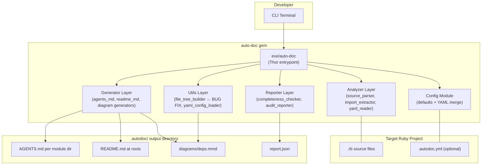
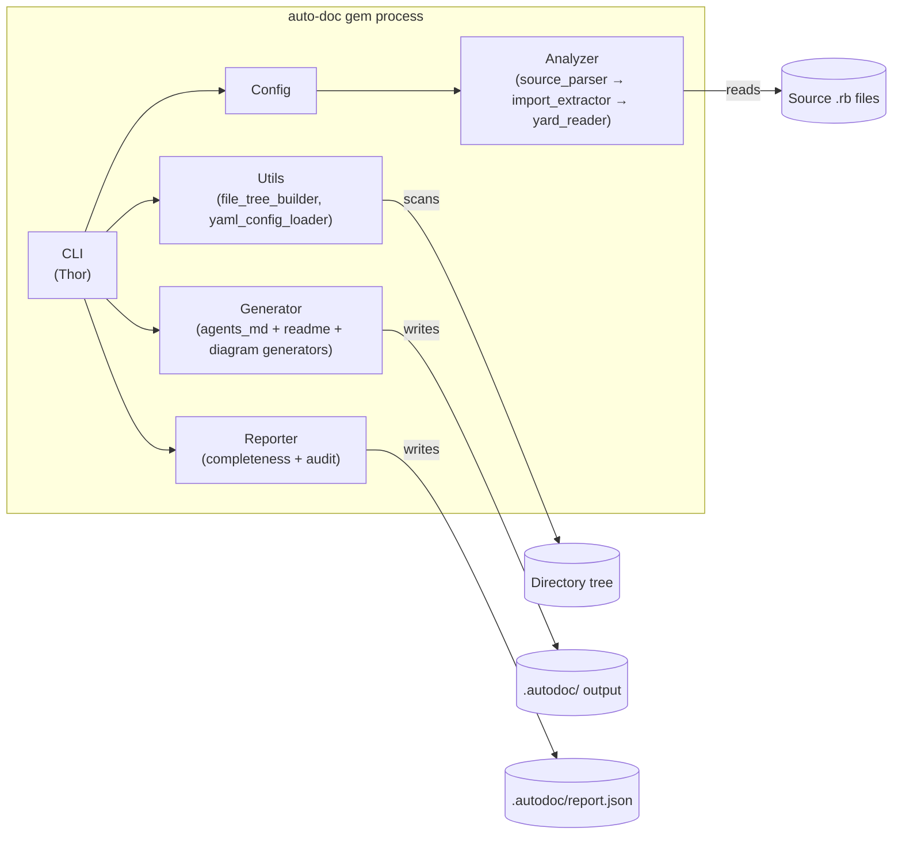

# auto-doc gem — Architecture Document

_Bug-fix project targeting `file_tree_builder` exclusion logic._

## System Context (C4 Level 1)



## Container Diagram (C4 Level 2)

Single-process architecture. All modules load into one Ruby VM via `require`. The CLI orchestrates the pipeline.



## Component Breakdown

### CLI (`cli.rb`)

```
generate(path, flags) -> OutputFiles
audit(path, threshold) -> Report
init(path) -> ConfigFile
version() -> String
```

**Responsibilities:** Thor-based command interface with 4 subcommands. Parses args, loads config, orchestrates pipeline order. Contains no business logic — delegates to all downstream modules.  
**Dependencies:** Config, Analyzer, Utils, Generator, Reporter.

### Config (`config.rb`)

```
merge(defaults, yaml_path, cli_flags) -> FlatConfigHash
```

**Responsibilities:** Merges three configuration sources in priority order: defaults < `.autodoc.yml` < CLI flags. Handles nil values from Thor gracefully. Outputs a flat config hash consumed by all downstream modules.  
**Dependencies:** yaml_config_loader (for YAML parsing).

### Analyzer Layer

Three single-purpose analyzers that parse Ruby source files independently:

#### `source_parser.rb`

```
parse(file_content) -> Symbols[]
extract_definitions(source) -> [ClassDef, ModuleDef]
get_method_signatures(def_node) -> MethodSig
```

Uses Ripper (stdlib) to extract class/module definitions, method signatures, and visibility modifiers.

#### `import_extractor.rb`

```
find_imports(file_content) -> ImportEdge[]
```

Finds `require`, `include`, `extend` statements to build dependency graph.

#### `yard_reader.rb`

```
extract(source) -> DocComments[]
```

Reads YARD-style doc comments above each definition.

**Analyzer Layer — Responsibilities:** Source code parsing and symbol extraction. No file I/O or output generation.  
**Analyzer Layer — Dependencies:** Ruby stdlib Ripper for AST parsing.

### Utils Layer

#### `file_tree_builder.rb` ← **BUG FIX TARGET**

```
build(path, exclude_patterns) -> String
should_exclude?(basename, patterns) -> Boolean
```

Walks directory tree, applies exclusion patterns via `File.fnmatch`, produces formatted ASCII tree text.  
**Bug:** `should_exclude?` receives exclusion patterns as an Array from config but may pass individual elements to `File.fnmatch(pattern, basename)` where the pattern is still a nested array (from config merge producing `[["spec", "test"], ["vendor"]]`). Fix: ensure each value passed to `fnmatch` is a String, not an Array.  
**Dependencies:** File::FnMatch (stdlib).

#### `yaml_config_loader.rb`

```
load(yaml_path) -> Hash | {}
validate(config_hash) -> ValidationResult
```

Loads `.autodoc.yml`, validates structure, returns hash or empty config on failure.

### Generator Layer

Three generators consuming analyzer results + file tree text to produce output files via ERB templates:

#### `agents_md_generator.rb`

```
render(data) -> String
```

Produces AGENTS.md per module directory with Purpose, Structure (tree), Dependencies table, Public API Surface.

#### `readme_generator.rb`

```
render(data) -> String
```

Produces README.md at module roots with Overview and Files table (with coverage indicators).

#### `diagram_generator.rb`

```
generate_mermaid(edges) -> String
```

Produces Mermaid DAG of cross-directory imports.

**Generator Layer — Responsibilities:** ERB template rendering and output file writing. All data preparation happens upstream; generators receive local variables and render.  
**Generator Layer — Dependencies:** Ruby stdlib ERB.

### Reporter Layer

#### `completeness_checker.rb`

```
calculate(symbols, documented_count) -> { percentage => Float, by_type => Hash }
```

Calculates percentage of documented vs. undocumented symbols per type.

#### `audit_reporter.rb`

```
format_table(report_data) -> String
write_json(report_data, path) -> void
check_threshold(percentage, threshold) -> Boolean
```

Formats report as table (stdout) and JSON (`.autodoc/report.json`). Supports `--threshold` flag for CI gating.

## Data Flow

```
CLI generate <path>
  → Config merges defaults + YAML + CLI args
  → Analyzer scans all .rb files in path:
      source_parser → extracts classes/modules/methods/visibility
      import_extractor → builds dependency edges
      yard_reader.extract() → reads doc comments
  → Utils.file_tree_builder walks directory, applies exclusion patterns → ASCII tree text
  → Generator consumes analysis results + tree text → writes ERB-rendered files to .autodoc/
```

## Architecture Decision Records

### ADR-001: Ripper over Parser for AST parsing
**Status:** Accepted  
**Context:** Need to parse Ruby source files into a navigable AST without adding external dependencies.  
**Decision:** Use Ripper (Ruby stdlib) for class/module extraction and method signature parsing.  
**Consequences:** Zero gem dependencies; faster install. Cannot handle dynamic definitions (`define_method`, `const_set`) — documented as known limitation, not a bug. Parser gem would add dependency overhead for v1.

### ADR-002: Stateless per-invocation tool
**Status:** Accepted  
**Context:** Tool must work reliably in CI pipelines and ad-hoc developer workflows without setup or maintenance between runs.  
**Decision:** auto-doc reads source code, produces output files, exits. No database, no cached state between invocations.  
**Consequences:** Every run is a full re-scan (cheap for typical projects). Regeneration is idempotent. CI-friendly — no warm-up or migration step needed.

### ADR-003: ERB templates for document generation
**Status:** Accepted  
**Context:** Generated documents (AGENTS.md, README.md) have complex structure but predictable data shapes from analyzers.  
**Decision:** Use stdlib ERB to separate content layout from data preparation. Generators prepare local variables; templates render them.  
**Consequences:** Templates are version-controlled and human-readable. Keeps generators thin. No template engine dependency to manage.

## Bug Fix Scope: `file_tree_builder.rb` TypeError

### Problem

`should_exclude?(basename, patterns)` passes a value to `File.fnmatch(pattern, basename)` where `pattern` is an Array instead of String, causing `TypeError`.

### Root Cause

Config merging combines default exclusion patterns (Array) with YAML-specified patterns (String or Array). When both are arrays and merged via `+`, the result may be nested: `[["spec", "test"], ["vendor"]]`. Iterating this outer array yields inner Arrays, not Strings.

### Input Shapes to Handle

| Source | Shape | Example |
|---|---|---|
| CLI default only | `Array<String>` | `["spec", "test"]` |
| YAML string override | `String` (wrapped) | `"vendor"` → `["vendor"]` |
| YAML array merge | `Array<Array<String>>` | `[["spec"], ["vendor"]]` |
| Nil from Thor | `nil` | — |

### Fix Strategy

In `should_exclude?`, normalize each pattern defensively before passing to `File.fnmatch`:

1. Use `Array(pattern).flatten.map(&:to_s)` at the point of use to handle all input shapes
2. Skip nil or empty entries gracefully
3. Do not change the config contract upstream — this fix makes `file_tree_builder` resilient to whatever shape arrives

This is a single-method change in one file with no ripple effects on other components.
