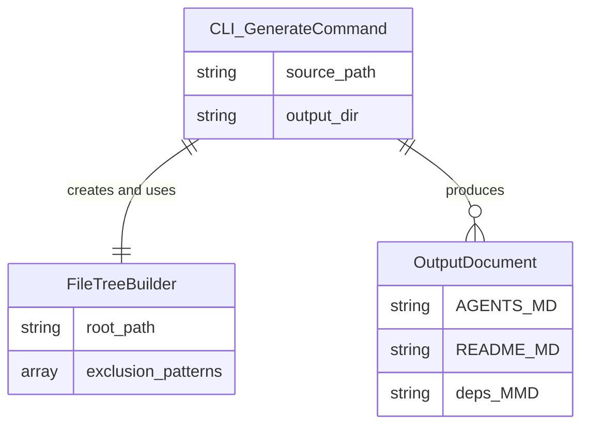

# Data Model: Fix FileTreeBuilder Exclusion Crash

## Overview

This bug fix involves a single class: `FileTreeBuilder`. No database changes, no new entities, no schema migrations. The fix is purely a defensive programming change to the `should_exclude?` method.

## Entity Relationship Diagram



## Entity: FileTreeBuilder

**Purpose:** Builds a directory tree structure from a root path, excluding files and directories that match configured exclusion patterns.

**Lifecycle:** Created per generate invocation. Stateless after construction — all computation happens in method calls.

### Fields

| Field | Type | Required | Default | Mutable | Description |
|-------|------|----------|---------|---------|-------------|
| `root_path` | String | Yes | — | No | Absolute path to the source directory root. Set at construction. |
| `exclusion_patterns` | Array | No | `[]` | No | Glob patterns for path exclusion. May contain nested arrays from configuration sources. Set at construction. |

### Methods

| Method | Visibility | Parameters | Return Type | Description |
|--------|-----------|------------|-------------|-------------|
| `initialize` | public | `root_path: String, exclusion_patterns: Array = []` | `FileTreeBuilder` | Stores root_path and exclusion_patterns as instance variables. |
| `build_tree` | public | (none) | Directory tree (Hash/Node) | Entry point. Delegates to `collect_files(@root_path)`. Returns the full directory tree structure with exclusions applied. |
| `should_exclude?` | private | `file_path: String` | `Boolean` | **THE FIXED METHOD.** Evaluates whether a given absolute file path matches any exclusion pattern. Strips root_path prefix to get relative path. Flattens patterns, skips non-strings, calls `File.fnmatch`. Returns `true` if any pattern matches, `false` otherwise. |
| `collect_files` | private | `dir: String` | Array | Recursively reads directory entries. Calls `should_exclude?` for each entry. Recurses into subdirectories that are not excluded. |

### should_exclude? — Detailed State Machine

```
Input: file_path (String, absolute path)

STEP 1: Strip root_path prefix
    relative_path = file_path.sub(@root_path, "")
    Edge case: if file_path == @root_path, relative_path = ""

STEP 2: Flatten exclusion patterns
    patterns = @exclusion_patterns.flatten
    Edge case: @exclusion_patterns = [] → flattened = []
    Edge case: @exclusion_patterns = ["/lib", ["/test", ["/spec"]]] → flattened = ["/lib", "/test", "/spec"]

STEP 3: Iterate patterns
    For each pattern in patterns:
        STEP 3a: Skip non-strings
            next unless pattern.is_a?(String)
            Edge case: pattern = nil → skipped
            Edge case: pattern = 42 → skipped
            Edge case: pattern = ["nested"] → skipped (flatten catches one level, but this guards deeper)
        
        STEP 3b: fnmatch comparison
            return true if File.fnmatch(pattern, relative_path)
            Edge case: pattern = "**/*.rb", relative_path = "/lib/utils.rb" → true (wildcard match)
            Edge case: pattern = "/lib", relative_path = "/lib/utils.rb" → false (exact match only)

STEP 4: No match found
    return false
```

### Exclusion Pattern Sources

Exclusion patterns enter `FileTreeBuilder` from the `GenerateCommand`, which reads them from configuration:

```
Config (YAML/JSON/defaults)
    │
    ▼
GenerateCommand (reads exclusion config)
    │
    ▼
FileTreeBuilder.new(path, config.exclusion_patterns)
```

The configuration source can produce nested arrays when:
- Multiple config files are merged
- YAML anchors/aliases create nested structures
- Default patterns are combined with user-specified patterns using array concatenation that nests rather than flattens

### Pre-Fix vs Post-Fix Behavior

| Input | Pre-Fix Behavior | Post-Fix Behavior |
|-------|-----------------|-------------------|
| `exclusion_patterns = ["/lib", "/test"]` | Works: fnmatch receives strings | Works: flattened, all strings pass guard, fnmatch called normally |
| `exclusion_patterns = ["/lib", ["/test"]]` | **CRASHES**: fnmatch receives `["/test"]` (Array, not String) → TypeError | Works: flattened to `["/lib", "/test"]`, both strings |
| `exclusion_patterns = []` | Works: loop does not execute, returns false | Works: flattened stays `[]`, loop does not execute |
| `exclusion_patterns = [nil, "/lib"]` | **CRASHES**: fnmatch receives nil → TypeError | Works: nil skipped by `is_a?(String)` guard, `/lib` matched |
| `exclusion_patterns = ["/lib", [nil, ["/test"]]]` | **CRASHES**: fnmatch receives Array or nil | Works: flattened to `["/lib", nil, "/test"]`, nil skipped, both strings matched |

## Entity: CLI Generate Command

**Purpose:** Entry point for `auto-doc generate <path>`. Orchestrates the full pipeline.

### Fields

| Field | Type | Source |
|-------|------|--------|
| `source_path` | String | CLI argument |
| `output_dir` | String | `--output-dir` flag or default `.autodoc/` |
| `exclusion_patterns` | Array | Configuration (may be nested) |

### Data Flow

```
source_path → FileTreeBuilder.new(source_path, exclusion_patterns)
                    │
                    ▼
              build_tree → tree structure
                    │
                    ▼
              YardReader → parsed modules, classes, methods
                    │
                    ▼
              DocumentWriters → AGENTS.md, README.md, deps.mmd
```

## Entity: Output Documents

**Purpose:** Generated documentation files written to the `.autodoc/` directory.

| File | Format | Generated By |
|------|--------|-------------|
| `.autodoc/AGENTS.md` | Markdown | AgentsDocWriter |
| `.autodoc/README.md` | Markdown | ReadmeDocWriter |
| `.autodoc/diagrams/deps.mmd` | Mermaid | DepsDiagramWriter |

All three files must exist and be non-empty (> 0 bytes) for a successful generate invocation.

## No Persistence Layer

This is a CLI tool that reads from the file system and writes to the file system. There is no database, no ORM, no REST API for data persistence. FileTreeBuilder is a pure computation class — it reads directory metadata and returns an in-memory tree structure.
