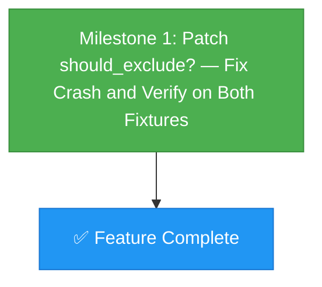

# Dependency Graph: Fix FileTreeBuilder Exclusion Crash

## Build Order

| Order | Milestone | Type | Depends On |
|-------|-----------|------|------------|
| 1 | Milestone 1: Patch should_exclude? | Self-contained | Nothing |

**Total milestones: 1**

### Notes

- This is a single-milestone project because the bug fix is a 2-line change in one method of one file
- All prerequisites (gem loadable, fixture directories exist, previous fixes verified) are checked in playbook Section 0
- Milestone 1 is independently testable — no other milestone needs to complete first
- Feature complete immediately upon Milestone 1 verification passing
