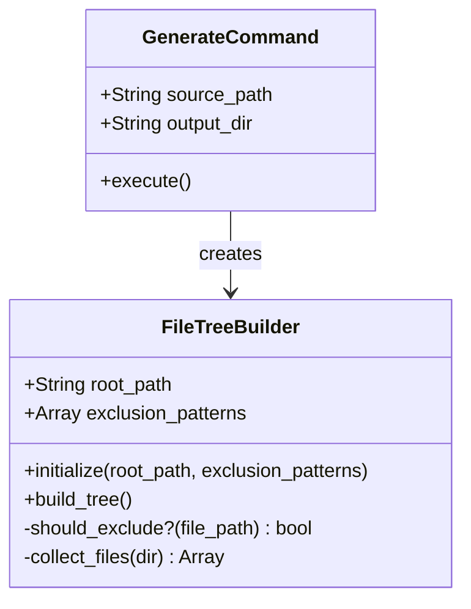

# Project Plan: Fix FileTreeBuilder Exclusion Crash

**Project:** 2026-07-13-fix-critical-bug-home
**Summary:** A single-method fix in `FileTreeBuilder#should_exclude?` — add flatten + type guard before `File.fnmatch` to prevent TypeError crash when exclusion patterns contain non-string values (nested arrays, nil, etc.). One milestone, one file changed, verified on both fixtures plus regression checks on `version` and `init`.

---

## Milestone 1: Patch should_exclude? — Fix Crash and Verify on Both Fixtures

_Self-contained._

**Intent:** Fix the TypeError crash in `FileTreeBuilder#should_exclude?` by adding flatten and non-string guard before calling `File.fnmatch`. Verify the fix on both fixture projects (`sample_ruby_project` and `minimal_gem`). Confirm no regression on `auto-doc version` and `auto-doc init`.

**Satisfies:** FR-1 (exclusion patterns never passed non-string values), FR-2 (generate completes on both fixtures), FR-3 (version and init continue to work).

**Dependencies:** None. All modules already exist, pass syntax checks, and previous fixes (config nil handling, YardReader) are verified working. This is the only remaining blocker.

---

### Architecture

```
┌─────────────────────────────────────────────────────────────────┐
│  FileTreeBuilder (before fix → after fix)                        │
│                                                                  │
│  should_exclude?(file_path)                                      │
│                                                                  │
│  BEFORE:                                                         │
│    @exclusion_patterns.each do |pattern|                         │
│      return true if File.fnmatch(pattern, relative_path)         │
│    end                                                           │
│  CRASH: pattern is Array → "no implicit conversion of Array"     │
│                                                                  │
│  AFTER:                                                          │
│    @exclusion_patterns.flatten.each do |pattern|                 │
│      next unless pattern.is_a?(String)                           │
│      return true if File.fnmatch(pattern, relative_path)         │
│    end                                                           │
│  FIXED: nested arrays flattened, non-string entries skipped      │
└─────────────────────────────────────────────────────────────────┘
```

**Data flow:**

```
User runs: auto-doc generate <fixture_path>
    │
    ▼
GenerateCommand reads exclusion_patterns from config
    │  (may contain nested arrays from merged config)
    ▼
FileTreeBuilder.new(path, config.exclusion_patterns)
    │
    ├── @exclusion_patterns = ["/lib", ["/test"]]  (before flatten)
    │
    └── build_tree ──▶ collect_files ──▶ should_exclude?
                                              │
                                              ├── patterns.flatten → ["/lib", "/test"]
                                              ├── each: String check → fnmatch → match?
                                              └── returns true/false (NEVER crashes)
    │
    ▼
DocumentWriters → .autodoc/AGENTS.md, README.md, diagrams/deps.mmd
```

---

### File Structure

Only one file changes:

| File | Status | Change |
|------|--------|--------|
| `lib/auto_doc/utils/file_tree_builder.rb` | MODIFIED | `should_exclude?`: add `.flatten` + `is_a?(String)` guard |
| All other files | UNCHANGED | No modifications |

```
auto-doc-tool/
├── lib/auto_doc/utils/
│   └── file_tree_builder.rb      ← MODIFIED (only this file)
├── fixtures/sample_ruby_project/  ← VERIFY (generation target)
├── fixtures/minimal_gem/          ← VERIFY (generation target)
└── exe/auto-doc                   ← UNCHANGED (regression test target)
```

---

### Class Design



**Single method change — `should_exclude?` only:**

| Aspect | Before Fix | After Fix |
|--------|-----------|-----------|
| Pattern iteration | `@exclusion_patterns.each` | `@exclusion_patterns.flatten.each` |
| Type guard | None | `next unless pattern.is_a?(String)` |
| fnmatch call | `File.fnmatch(pattern, relative_path)` | Unchanged (only reached for String patterns) |
| Return type | Boolean or CRASH | Always Boolean |

**No other methods change.** No constructor signature change. No public API change.

---

### Implementation

#### Backend Work Items
1. **Models & Types**: N/A — only method logic change, no new types
2. **Services**: Edit `should_exclude?` in `lib/auto_doc/utils/file_tree_builder.rb`:
   - Change `@exclusion_patterns.each` to `@exclusion_patterns.flatten.each`
   - Add `next unless pattern.is_a?(String)` as the first line inside the loop body
3. **API Routes**: N/A — CLI tool, no REST API
4. **Backend Tests**: N/A — no test suite targets this method (covered by manual verification per requirements)

#### Frontend Work Items
N/A — CLI tool, no frontend.

---

### Testing

| Phase | Scope | How |
|-------|-------|-----|
| **Unit** | N/A — pure defensive logic; no new logic to unit test independently | |
| **Integration (CLI)** | `should_exclude?` correctly distinguishes excluded vs non-excluded paths | Inline Ruby invocation via playbook Play 1.1 and 1.2 |
| **E2E (fixture)** | `auto-doc generate` on `fixtures/sample_ruby_project` | Full CLI run, verify exit code 0 and three output files (playbook Section 2) |
| **E2E (fixture)** | `auto-doc generate` on `fixtures/minimal_gem` | Full CLI run, verify exit code 0 and three output files (playbook Section 3) |
| **Regression** | `auto-doc version` and `auto-doc init` | CLI runs, verify exit code 0, no error output (playbook Section 4) |

---

### Verify

- [ ] `should_exclude?` accepts `["/lib", ["/test"]]` without crash — returns boolean
- [ ] `should_exclude?` correctly returns `true` for `/lib/test.rb` when pattern `/lib` is present
- [ ] `should_exclude?` correctly returns `false` for `/app/models/user.rb` when pattern `/lib` is present
- [ ] `auto-doc generate fixtures/sample_ruby_project` exits 0, creates 3 non-empty output files
- [ ] `auto-doc generate fixtures/minimal_gem` exits 0, creates 3 non-empty output files
- [ ] `auto-doc version` exits 0, outputs version string
- [ ] `auto-doc init <dir>` exits 0, creates initialization output
- [ ] Only `file_tree_builder.rb` changed — `git diff --stat` shows 1 file modified

---

### Cross-Cutting Impact

| Area | Impact | Mitigation |
|------|--------|-----------|
| Config loading | None — config already sends patterns as-is | Verify patterns arrive at FileTreeBuilder unchanged |
| YardReader | None — YardReader receives tree after exclusions applied, not patterns | No change to YardReader interface |
| Document writers | None — they receive tree structures, not pattern arrays | No change to writer interfaces |
| CLI argument parsing | None — no CLI changes | Verify version/init still work |
| Other utils | None — FileTreeBuilder is independent | No shared state or class coupling |
| Git diff | Single file, single method | Confirms NFR-1 compliance |

---

### Conventions

- **Ruby style:** Follow existing codebase conventions (2-space indent, `snake_case` methods, `?` suffix for predicates)
- **Minimal diff:** Only the two guard lines added inside the loop body — no reformatting, no comment changes, no reordering
- **Defensive programming:** Guard against ANY non-String type (not just Array), not the specific type seen in the crash
- **Language agnosticism preserved:** The project_plan does not assume Ruby syntax in prose; the Implementation items reference `.rb` extension naturally

---

### Estimated Effort

| Task | Time |
|------|------|
| Code change (2 lines) | 2 minutes |
| Verify inline test (Play 1.1, 1.2) | 5 minutes |
| Verify sample_ruby_project fixture | 5 minutes |
| Verify minimal_gem fixture | 3 minutes |
| Verify regression (version, init) | 3 minutes |
| **Total** | **~18 minutes** |

---

### Playbook Coverage

| Playbook Section | Milestone Coverage |
|-----------------|-------------------|
| Section 0: Smoke Test | Included — gem loads, FileTreeBuilder module loads |
| Section 1: Core Fix (FR-1) | Included — should_exclude? inline test |
| Section 2: Sample Fixture (FR-2) | Included — generate on sample_ruby_project |
| Section 3: Minimal Fixture (FR-2) | Included — generate on minimal_gem |
| Section 4: Regression (FR-3) | Included — version and init verification |
