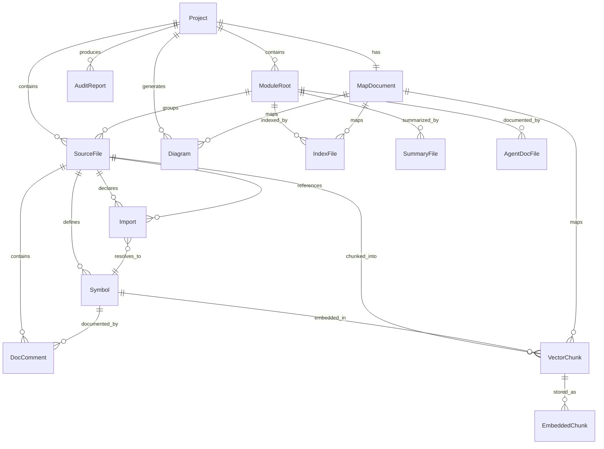

# Auto-Doc Tool — Data Model

## Sections

### 1. ER Diagram

### 2. Entity Tables

#### Project

The target codebase being documented by auto-doc.

| Field | Type | Constraints | Description |
|-------|------|-------------|-------------|
| root_path | string | not null | Absolute path to project root |
| name | string | not null | Project name (from Gemfile, gemspec, or directory name) |
| config | config | not null | Loaded .autodoc.yml configuration |
| module_roots | list[string] | not null | Detected module root directories |
| total_files | integer | not null | Total source files analyzed |
| total_symbols | integer | not null | Total public symbols found |
| generated_at | timestamp | not null | Timestamp of last generation |

#### ModuleRoot

A top-level directory designated as a documentation module boundary — detected via config (`module_roots`) or heuristics (dirs with >= 3 code files).

| Field | Type | Constraints | Description |
|-------|------|-------------|-------------|
| path | string | not null | Path relative to project root (e.g., "lib", "app/models") |
| directory_name | string | not null | Short name (e.g., "models") |
| file_count | integer | not null | Number of source files in this root subtree |
| symbol_count | integer | not null | Number of public symbols in this root subtree |
| subdirectories | list[string] | nullable | Nested module roots (recursive) |
| source_files | list[string] | not null | Files within this root |

#### SourceFile

A single Ruby source file (.rb) within the project.

| Field | Type | Constraints | Description |
|-------|------|-------------|-------------|
| path | string | not null | Path relative to project root |
| absolute_path | string | not null | Full filesystem path |
| content_hash | string | not null | SHA256 hash used for incremental embedding detection |
| lines_of_code | integer | not null | Total line count |
| symbols | list[string] | not null | All classes, modules, methods, constants defined |
| imports | list[string] | not null | All require/include/extend/prepend statements |
| doc_comments | list[string] | not null | All doc comment blocks found |
| last_modified | timestamp | not null | File modification timestamp |

#### Symbol

A named code element: class, module, method, or constant.

| Field | Type | Constraints | Description |
|-------|------|-------------|-------------|
| name | string | not null | Symbol name (e.g., "User", "find_by_email") |
| type | string | enum: class, module, method, constant | Kind of symbol |
| file_path | string | not null | Source file where defined |
| line_number | integer | > 0 | Line number of definition |
| visibility | string | enum: public, private, protected | Method visibility (methods only) |
| parent_modules | list[string] | nullable | Fully qualified module nesting (e.g., ["App", "Models"]) |
| scope_chain | string | nullable | "::" separated path (e.g., "App::Models::User") |
| signature | string | nullable | Method signature (methods only, e.g., "find_by_email(email)") |
| has_doc | boolean | not null | Whether symbol has a doc comment |
| doc_comment | string | nullable | Associated doc comment (nullable) |

#### Import

A dependency statement declaring that one file uses/references another.

| Field | Type | Constraints | Description |
|-------|------|-------------|-------------|
| type | string | enum: require, require_relative, include, extend, prepend | Type of import |
| target | string | not null | Target module/file path referenced |
| source_file | string | not null | File containing the import statement |
| line_number | integer | not null | Line number of import |
| resolved_path | string | nullable | Resolved file path, if resolvable |

#### DocComment

A documentation comment block associated with a symbol.

| Field | Type | Constraints | Description |
|-------|------|-------------|-------------|
| target_symbol | string | not null | Symbol this comment documents |
| target_type | string | enum: class, module, method | Type of target |
| text | string | not null | Full comment text |
| summary | string | not null | First line/sentence of comment |
| line_number | integer | not null | Line where comment starts |
| has_params | boolean | not null | Whether @param tags are present |
| has_return | boolean | not null | Whether @return tag is present |

#### IndexFile

Generated `_index.md` at a directory level providing hierarchical navigation.

| Field | Type | Constraints | Description |
|-------|------|-------------|-------------|
| path | string | not null | Path in .autodoc/ (e.g., ".autodoc/lib/utils/_index.md") |
| directory | string | not null | Source directory this index covers |
| subdirectories | list[string] | not null | Subdirectory names with brief summaries |
| files | list[string] | not null | Files in this directory with class/module names and method counts |
| cross_references | list[string] | not null | Links to sibling and parent indexes |
| generated_at | timestamp | not null | Timestamp |

#### SummaryFile

Generated `SUMMARY.md` per module root providing a developer overview.

| Field | Type | Constraints | Description |
|-------|------|-------------|-------------|
| path | string | not null | Path in .autodoc/ (e.g., ".autodoc/lib/SUMMARY.md") |
| module_root | string | not null | Module root directory |
| purpose | string | not null | Inferred purpose (from directory name and file structure) |
| key_classes | list[string] | not null | Key classes/modules with one-line descriptions |
| public_api | list[string] | not null | Public methods grouped by class |
| imports_overview | list[string] | not null | What this module imports |
| imported_by_overview | list[string] | not null | What imports this module |
| doc_coverage_pct | decimal | 0-100 | Percentage of documented public symbols |
| generated_at | timestamp | not null | Timestamp |

#### AgentDocFile

Generated `AGENTS.md` per directory providing full public API surface details.

| Field | Type | Constraints | Description |
|-------|------|-------------|-------------|
| path | string | not null | Path in .autodoc/ (e.g., ".autodoc/lib/AGENTS.md") |
| directory | string | not null | Source directory this doc covers |
| module_name | string | not null | Directory name for display |
| purpose_summary | string | not null | Auto-inferred or placeholder purpose text |
| file_tree | string | not null | Indented directory tree |
| symbols_table | list[string] | not null | All public symbols with type, documented status, line |
| dependencies_table | list[string] | not null | All imports with type, target, line |
| key_files | list[string] | not null | Notable files in this directory |
| generated_at | timestamp | not null | Timestamp |

#### Diagram

A generated Mermaid diagram file.

| Field | Type | Constraints | Description |
|-------|------|-------------|-------------|
| path | string | not null | Path in .autodoc/ (e.g., ".autodoc/diagrams/deps.mmd") |
| type | string | enum: deps, class, er | Diagram type |
| content | string | not null | Valid Mermaid syntax |
| node_count | integer | >= 0 | Number of nodes in diagram |
| edge_count | integer | >= 0 | Number of edges in diagram |
| generated_at | timestamp | not null | Timestamp |
| generation_condition | string | not null | What triggered this diagram (always, has_inheritance, has_schema) |

#### VectorChunk

A semantically chunked piece of source code for embedding. (Phase 3)

| Field | Type | Constraints | Description |
|-------|------|-------------|-------------|
| chunk_id | string | PK, unique | UUIDv4 unique identifier |
| source_file | string | not null | Source file path |
| symbol_name | string | not null | Function/class/method name |
| chunk_type | string | enum: class, module, method, file_header | What this chunk represents |
| line_start | integer | not null | Starting line number |
| line_end | integer | >= line_start | Ending line number |
| code_body | string | not null | First 20 lines of source code |
| docstring | string | nullable | Associated doc comment text |
| scope_chain | list[string] | nullable | Parent modules/classes |
| imports_context | list[string] | nullable | Surrounding import statements |
| content_hash | string | not null | SHA256 hash for change detection |
| doc_file | string | nullable | Path to AGENTS.md covering this chunk |
| summary_file | string | nullable | Path to SUMMARY.md for this module |
| index_file | string | nullable | Path to _index.md for this directory |

#### EmbeddedChunk

The stored vector embedding for a chunk. (Phase 3)

| Field | Type | Constraints | Description |
|-------|------|-------------|-------------|
| chunk_id | string | PK, FK to VectorChunk | UUIDv4 unique identifier |
| embedding | list[decimal] | not null, 384 dims | Vector embedding (all-MiniLM-L6-v2 = 384 dims) |
| model_name | string | not null | Embedding model identifier |
| generated_at | timestamp | not null | When this embedding was created |

#### MapDocument

The master cross-reference file (`map.json`) linking all generated artifacts.

| Field | Type | Constraints | Description |
|-------|------|-------------|-------------|
| schema_version | string | not null | Versioned schema identifier (e.g., "1.0") |
| generated_at | timestamp | not null | Generation timestamp |
| project_name | string | not null | Project name |
| vector_chunks | list[object] | nullable | Vector chunk → source file → doc file mappings |
| directory_indexes | list[string] | not null | Paths to all _index.md files |
| diagrams | list[string] | not null | Paths to all .mmd diagram files |
| module_roots | list[string] | not null | Paths to all module root directories |

**ChunkMapEntry structure:**

| Field | Type | Constraints | Description |
|-------|------|-------------|-------------|
| chunk_id | string | PK | UUID |
| source_file | string | not null | Relative path |
| doc_file | string | not null | AGENTS.md path |
| summary_file | string | not null | SUMMARY.md path |
| line_range | list[integer] | not null, 2 elements | [start, end] |
| symbol_name | string | not null | Symbol name |
| scope_path | string | not null | Full scope chain |

#### AuditReport

A documentation coverage audit result.

| Field | Type | Constraints | Description |
|-------|------|-------------|-------------|
| total_symbols | integer | not null | Total public symbols |
| documented | integer | not null | Symbols with doc comments |
| undocumented | integer | not null | Symbols without doc comments |
| coverage_percent | decimal | 0-100 | Coverage percentage |
| passed_threshold | boolean | not null | Whether coverage >= configured threshold |
| threshold | integer | not null | Configured threshold |
| failures | list[object] | not null | List of undocumented symbols |
| generated_at | timestamp | not null | When audit ran |
| project_path | string | not null | Project root |

**AuditFailure structure:**

| Field | Type | Constraints | Description |
|-------|------|-------------|-------------|
| file | string | not null | Source file path |
| symbol | string | not null | Symbol name |
| type | string | not null | Symbol type (class/module/method) |
| line | integer | not null | Line number |

## Relationship Cardinalities

| Relationship | From | To | Cardinality | Notes |
|-------------|------|-----|-------------|-------|
| contains | Project | ModuleRoot | 1:N | A project has 1+ module roots |
| contains | Project | SourceFile | 1:N | A project has many source files |
| groups | ModuleRoot | SourceFile | 1:N | A module root groups many files |
| defines | SourceFile | Symbol | 1:N | A file defines many symbols |
| declares | SourceFile | Import | 1:N | A file declares many imports |
| contains | SourceFile | DocComment | 1:N | A file contains many doc comments |
| documented_by | Symbol | DocComment | 1:0..1 | A symbol may have one doc comment |
| references | Import | SourceFile | N:1 | An import references one target file |
| resolves_to | Import | Symbol | N:0..1 | An import may resolve to a symbol |
| chunked_into | SourceFile | VectorChunk | 1:N | A file is chunked into many chunks |
| embedded_in | Symbol | VectorChunk | 1:1 | A symbol maps to one chunk |
| stored_as | VectorChunk | EmbeddedChunk | 1:1 | A chunk has one embedding vector |
| indexed_by | ModuleRoot | IndexFile | 1:1 | Each module root has one _index.md |
| summarized_by | ModuleRoot | SummaryFile | 1:1 | Each module root has one SUMMARY.md |
| documented_by | ModuleRoot | AgentDocFile | 1:N | A root has AGENTS.md at each level |
| maps | MapDocument | VectorChunk | 1:N | Map maps many chunks |
| maps | MapDocument | IndexFile | 1:N | Map lists all indexes |
| maps | MapDocument | Diagram | 1:N | Map lists all diagrams |
| generates | Project | Diagram | 1:N | Project generates 1-3 diagrams |
| produces | Project | AuditReport | 1:N | Project has many audit reports over time |
| has | Project | MapDocument | 1:1 | Project has one map document |

## Validation Rules

### Symbol
- `name` must be non-empty
- `type` must be one of: class, module, method, constant
- `line_number` must be positive
- `scope_chain` must be a valid "::" separated path or empty for top-level

### Import
- `type` must be one of: require, require_relative, include, extend, prepend
- `target` must be non-empty
- `source_file` must reference an existing file in the project

### VectorChunk
- `chunk_id` must be unique across all chunks
- `line_start` <= `line_end`
- `content_hash` is required for change detection

### MapDocument
- `schema_version` must be present and parseable as semver-ish (e.g., "1.0")
- `vector_chunks` may be empty (when no --embed flag used)
- `directory_indexes` must list all generated _index.md files

### AuditReport
- `total_symbols` = `documented` + `undocumented`
- `coverage_percent` = (`documented` / `total_symbols`) * 100 (0/0 = 100%)
- `passed_threshold` = `coverage_percent` >= `threshold`